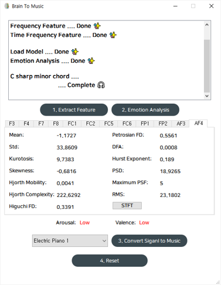

## Brain-to-Music : Implementation of EEG-based user-friendly music composition algorithm

뇌파를 기반으로 음악을 만들고자 하는 시도는 알파(8Hz-12.99Hz)파의 진폭이나 단순한 특징을 이용해
음악을 작곡하는 알고리즘부터, 스트레스 상태를 분석하고 이를 완화하기 위한 음악을 작곡하는
알고리즘까지 다양한 방법들로 이루어져 왔다. 앞선 연구들과 차별점을 두어 뇌파를 통해
자신의 감정 상태를 잘 나타내기 위한 음악을 작곡하는 알고리즘을 구현하고자 하였다. 뇌파에서 다양한
Feature들을 추출하고, 이를 이용해 감정분석 모델 및 작곡 알고리즘을 구현하였으며, 작곡 시 원하는
악기를 선택할 수 있도록 하였다. 또한 이를 GUI 형태의 어플리케이션으로 제작하여 사용자가 쉽게
이해하고 다룰 수 있도록 하였다. 우리가 제시하는 작곡 알고리즘을 통해 사용자는 자신 내면의
감정을 한층 더 깊이 이해할 수 있을 것이다. 


----

### 사용한 라이브러리: 
 
 
 
 
 
 


- **Python** 3.7 or higher
- **Key Libraries**:  
  ```bash
  pip install pyqt5 numpy scipy pandas scikit-learn mido pretty_midi matplotlib jupyter
  ```

----

### Directory: 
```
SWC_DACapstoneDesign/
├── GUI/                        # PyQt5 frontend application code
├── code/                       # Core signal‑to‑music pipeline
│   ├── application.py          # Entry point launching the GUI
│   ├── feature_extractor.py    # EEG feature computation
│   ├── emotion_analysis_model.py  # Trained arousal/valence classifiers
│   ├── convert_signal_to_music.py # Maps features to MIDI events
├── model/                      # Machine learning model files (pretrained weights)
├── music/                      # Sample output MIDI files
├── music_control_feature/      # Feature‑specific MIDI control configurations
├── notebook/                   # Jupyter notebooks for data exploration and training
├── [2021 하반기 LINC 캡스톤디자인 경진대회 수상] 포스터.pdf   # Competition poster
├── [데이터분석 캡스톤디자인] 최종 발표자료.pdf             # Final presentation slides
└── README.md                   # Project overview (this file)
```

- **GUI** : PyQT를 이용해 제작한, Graphic User Interface를 사용하기 위한 코드
- **code**  :
    - **application.py** : Application을 실행시키는 Main File
    - convert_signal_to_music.py : 뇌파 신호를 음악으로 변환하기 위한 알고리즘을 구현한 코드
    - emotion_analysis_model.py : 학습된 모델을 이용하여 뇌파의 감정을 분석하기 위한 코드
    - feature_extractor.py : 뇌파에서 다양한 feature를 추출하기 위한 코드

- **model** : 감정분석을 위해 뇌파 데이터에서 추출한 Feature를 이용하여 Arousal과 Valence를 각각 예측하는 이진 분류 기계학습 모델
- **music** : Application을 이용해 뇌파를 음악으로 변환한 Sample midi file
- **music_control_feature** :
    - high/low_kurtosis : Volume을 조절하기 위해 기존 데이터에서 Kurtosis를 분석한 결과


----
### 실행방법: 


0. `code`폴더의 `application.py`를 실행하여 어플리케이션 시작
1. EEG Data를 상단의 Box에 Drag and Drop 
2. `Extract Feature`를 통해서 EEG Data에서 필요한 특성들을 추출 
3. `Emotion Analysis`를 통해서 현재 사용자의 EEG Data에 대한 Arousal과 Valence 예측
4. 좌측 하단에서 사용자가 원하는 악기를 선택 
5. `Convert Signal to Music`를 통해서 EEG Data를 이용하여 Midi File 생성 및 저장
6. `Reset` 버튼을 통해서 기존의 내용을 초기화 

## Notes

- EEG file format: Ensure input files are in **.csv** format with channel headers matching the 10–20 system.  
- Model retraining: Training scripts and datasets are available in the `notebook/` directory for customizing emotion classifiers.  
- MIDI customization: Modify `music_control_feature/` configurations to adjust mapping between EEG features and musical parameters.

---
